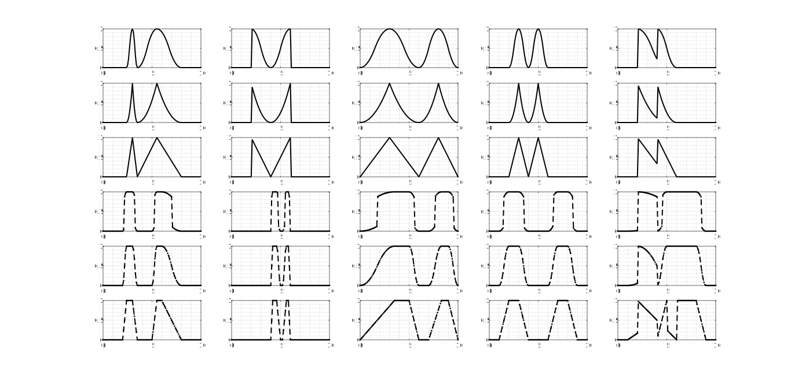

# MFuzzyMF
#### M-shaped Fuzzy Membership Functions
[](https://zenodo.org/badge/latestdoi/151821877)

###### Author: Somefun Oluwasegun
###### Email: oasomefun@ieee.org
###### (c) 2018
###### Dept: EEE/CPE, FUTA

#### Usage
###### MFMF(X, PARAMS, OPTION) returns a matrix which is the M-shaped membership function evaluated at X. 

###### PARAMS = PARAMS = [X0,X1,..,X4]  or [X0,X1,..,X7] is a 5-element or an 8-element vector that determines the break points of this membership function. 
###### A special case of the M-shape MF is the triggered [Pulse-MF](https://github.com/somefunAgba/PulseMF)



```Matlab
  For example:
    x = 0:0.1:10;
    mh =figure();
    %% type-1
    % We can write the letter M in 5!=120 different ways
    subplot(651); ax11 = plot(x, mfmf(x, [2.4 3 3.5 5.5 8]), '-.k');
    ax11.LineWidth = 1.5;
    grid on; grid minor;
    subplot(652); ax12 = plot(x, mfmf(x, [3 2 4 6 5]), '-.k');
    ax12.LineWidth = 1.5;
    grid on; grid minor;
    subplot(653); ax13 = plot(x, mfmf(x, [0 3 6 8 10]), '-.k');
    ax13.LineWidth = 1.5;
    grid on; grid minor;
    subplot(654); ax14 = plot(x, mfmf(x, [2 3 4 5 6]), '-.k');
    ax14.LineWidth = 1.5;
    grid on; grid minor;
    subplot(655); ax15 = plot(x, mfmf(x, [3 2 5 4 6]), '-.k');
    ax15.LineWidth = 1.5;
    grid on; grid minor;
    %% type-1.2
    % We can write the letter M in 5!=120 different ways
    subplot(656); ax21 = plot(x, mfmf(x, [2.4 3 3.5 5.5 8],1.2), '-.k');
    ax21.LineWidth = 1.5;
    grid on; grid minor;
    subplot(657); ax22 = plot(x, mfmf(x, [3 2 4 6 5], 1.2), '-.k');
    ax22.LineWidth = 1.5;
    grid on; grid minor;
    subplot(658); ax23 = plot(x, mfmf(x, [0 3 6 8 10], 1.2), '-.k');
    ax23.LineWidth = 1.5;
    grid on; grid minor;
    subplot(659); ax24 = plot(x, mfmf(x, [2 3 4 5 6], 1.2), '-.k');
    ax24.LineWidth = 1.5;
    grid on; grid minor;
    subplot(6,5,10); ax25 = plot(x, mfmf(x, [3 2 5 4 6], 1.2), '-.k');
    ax25.LineWidth = 1.5;
    grid on; grid minor;
    %% type-1.3
    % We can write the letter M in 5!=120 different ways
    subplot(6,5,11); ax31 = plot(x, mfmf(x, [2.4 3 3.5 5.5 8],1.3), '-.k');
    ax31.LineWidth = 1.5;
    grid on; grid minor;
    subplot(6,5,12); ax32 = plot(x, mfmf(x, [3 2 4 6 5], 1.3), '-.k');
    ax32.LineWidth = 1.5;
    grid on; grid minor;
    subplot(6,5,13); ax33 = plot(x, mfmf(x, [0 3 6 8 10], 1.3), '-.k');
    ax33.LineWidth = 1.5;
    grid on; grid minor;
    subplot(6,5,14); ax34 = plot(x, mfmf(x, [2 3 4 5 6], 1.3), '-.k');
    ax34.LineWidth = 1.5;
    grid on; grid minor;
    subplot(6,5,15); ax35 = plot(x, mfmf(x, [3 2 5 4 6], 1.3), '-.k');
    ax35.LineWidth = 1.5;
    grid on; grid minor;
    %% type-2
    % We can spawn the letter M in 8!=40,320 different ways
    subplot(6,5,16); ax41 = plot(x, mfmf(x, [2 2.4 3 3.5 5 5.5 6 8], 2), '--.k');
    ax41.LineWidth = 1.5;
    grid on; grid minor;
    subplot(6,5,17); ax42 = plot(x, mfmf(x, [4 4.2 4.6 5 5.2 5.6 5.8 6], 2), '--.k');
    ax42.LineWidth = 1.5;
    grid on; grid minor;
    subplot(6,5,18); ax43 = plot(x, mfmf(x, [0 3.5 5 6 7 8.3 9 10], 2), '--.k');
    ax43.LineWidth = 1.5;
    grid on; grid minor;
    subplot(6,5,19); ax44 = plot(x, mfmf(x, [1 2 3 4 6 7 8 9], 2), '--.k');
    ax44.LineWidth = 1.5;
    grid on; grid minor;
    subplot(6,5,20); ax45 = plot(x, mfmf(x, [1 7 2 6 4 5 8 9], 2), '--.k');
    ax45.LineWidth = 1.5;
    grid on; grid minor;
    %% type-2.2
    % We can spawn the letter M in 8!=40,320 different ways
    subplot(6,5,21); ax51 = plot(x, mfmf(x, [2 2.4 3 3.5 5 5.5 6 8], 2.2), '--.k');
    ax51.LineWidth = 1.5;
    grid on; grid minor;
    subplot(6,5,22); ax52 = plot(x, mfmf(x, [4 4.2 4.6 5 5.2 5.6 5.8 6], 2.2), '--.k');
    ax52.LineWidth = 1.5;
    grid on; grid minor;
    subplot(6,5,23); ax53 = plot(x, mfmf(x, [0 3.5 5 6 7 8.3 9 10], 2.2), '--.k');
    ax53.LineWidth = 1.5;
    grid on; grid minor;
    subplot(6,5,24); ax54 = plot(x, mfmf(x, [1 2 3 4 6 7 8 9], 2.2), '--.k');
    ax54.LineWidth = 1.5;
    grid on; grid minor;
    subplot(6,5,25); ax55 = plot(x, mfmf(x, [1 7 2 6 4 5 8 9], 2.2), '--.k');
    ax55.LineWidth = 1.5;
    grid on; grid minor;
    %% type-2.3
    % We can spawn the letter M in 8!=40,320 different ways
    subplot(6,5,26); ax61 = plot(x, mfmf(x, [2 2.4 3 3.5 5 5.5 6 8], 2.3), '--.k');
    ax61.LineWidth = 1.5;
    grid on; grid minor;
    subplot(6,5,27); ax62 = plot(x, mfmf(x, [4 4.2 4.6 5 5.2 5.6 5.8 6], 2.3), '--.k');
    ax62.LineWidth = 1.5;
    grid on; grid minor;
    subplot(6,5,28); ax63 = plot(x, mfmf(x, [0 3.5 5 6 7 8.3 9 10], 2.3), '--.k');
    ax63.LineWidth = 1.5;
    grid on; grid minor;
    subplot(6,5,29); ax64 = plot(x, mfmf(x, [1 2 3 4 6 7 8 9], 2.3), '--.k');
    ax64.LineWidth = 1.5;
    grid on; grid minor;
    subplot(6,5,30); ax65 = plot(x, mfmf(x, [1 7 2 6 4 5 8 9], 2.3), '--.k');
    ax65.LineWidth = 1.5;
    grid on; grid minor;
    set(mh, 'name', 'M-MF', 'numbertitle', 'off');
```
